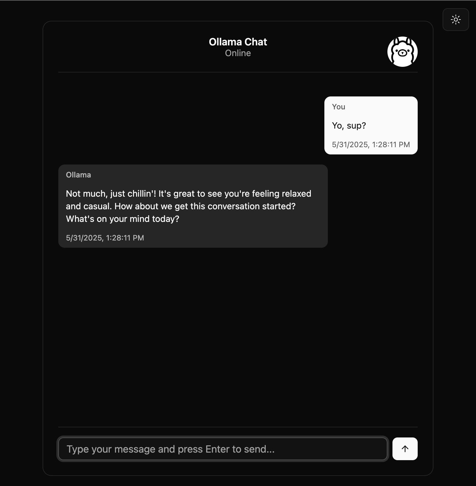
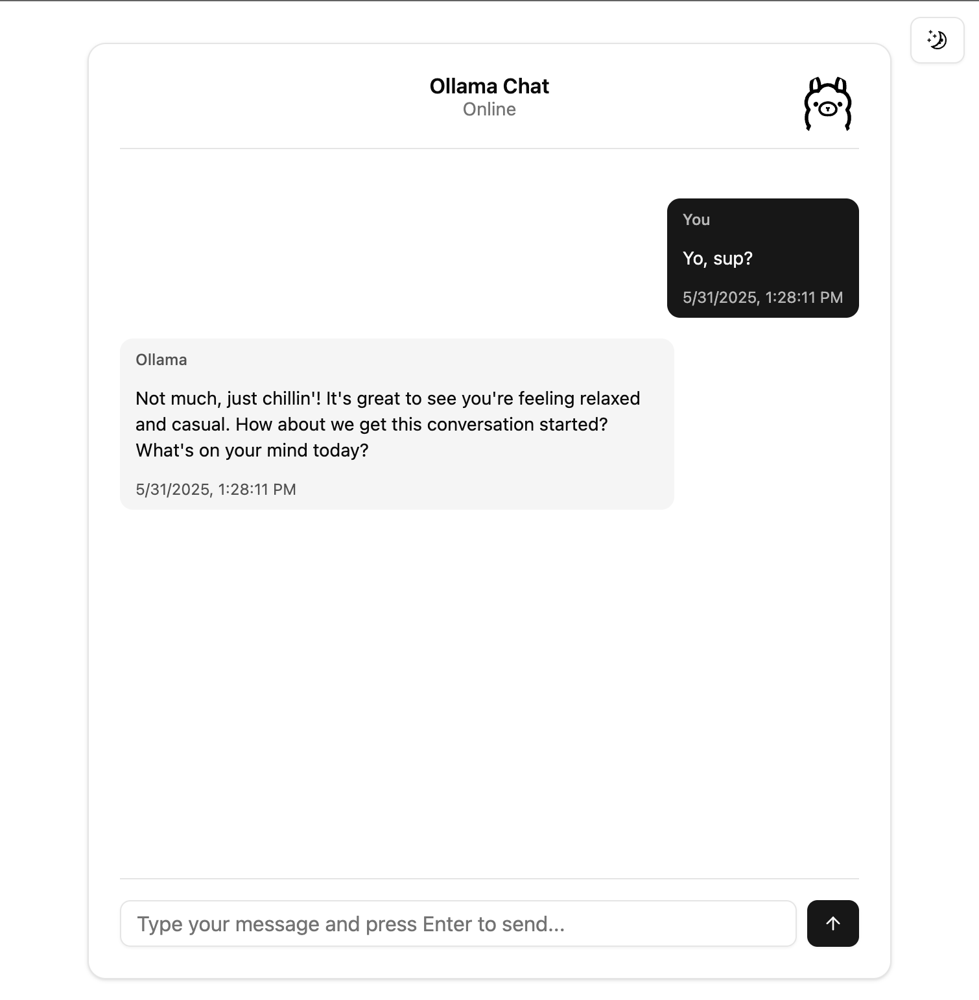
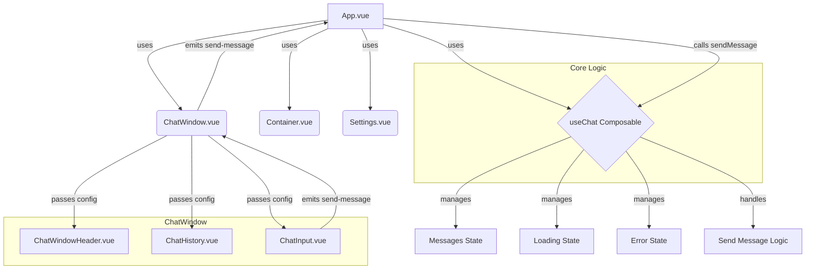

# Chat UI

🚧 Work in Progress 🚧

<video src="./docs/demo.mov" width="50%" />





## Project Overview

The Chat UI is a pnpm monorepo with the core UI components located in `packages/core`. It's built with Vue.js and Vite.

## Mermaid Flow Diagram



## Component Overview

### `App.vue`
- **Description**: The main application component.
- **Responsibilities**:
    - Initializes and uses the `useChat` composable.
    - Defines the `ChatConfig` object.
    - Renders `Container`, `Settings`, and `ChatWindow`.
    - Handles the `sendMessage` event from `ChatWindow` and calls the `sendMessage` function from `useChat`.

### `ChatWindow.vue`
- **Description**: Displays the main chat interface.
- **Props**:
    - `chatConfig: ChatConfig`: Configuration for the chat window (title, avatar, messages, etc.).
- **Emits**:
    - `sendMessage(message: string)`: When the user sends a new message.
- **Internal Components**:
    - `ChatWindowHeader.vue`: Displays the chat title, subtitle, and avatar.
    - `ChatHistory.vue`: Displays the list of messages.
    - `ChatInput.vue`: Provides the input field for the user to type messages.
- **Functionality**:
    - Receives `chatConfig` and provides it to its child components using Vue's `provide` (`PROVIDER_KEY_CHAT_CONFIG`).

### `ChatWindowHeader.vue`
- **Description**: Renders the header of the chat window.
- **Consumes (via inject)**:
    - `chatConfig`: To display title, subtitle, avatar.

### `ChatHistory.vue`
- **Description**: Renders the scrollable list of chat messages.
- **Consumes (via inject)**:
    - `chatConfig`: Specifically the `messages`, `loading`, and `errorMessage` properties.

### `ChatInput.vue`
- **Description**: The input component for users to type and send messages.
- **Emits**:
    - `sendMessage(message: string)`: When the user submits a message.
- **Consumes (via inject)**:
    - `chatConfig`: Potentially for sender information or other input-related configurations.

### `Settings.vue`
- **Description**: (Assumed) Allows users to configure chat settings. The exact functionality needs further inspection of `Settings.vue`.

### `Container.vue`
- **Description**: (Assumed) A layout component for padding and structure.

## Composables

### `useChat`
- **Description**: A Vue composable that encapsulates the core chat logic.
- **Exports**:
    - `sendMessage(payload: { content: string, streaming: boolean })`: Function to send a message.
    - `messages: Ref<ChatMessage[]>`: Reactive array of chat messages.
    - `loading: Ref<boolean>`: Reactive flag indicating if a message is being sent/received.
    - `errorMessage: Ref<string | null>`: Reactive string for any error messages.
- **Functionality**:
    - Manages the state of chat messages.
    - Handles the logic for sending messages (likely interacts with a backend service, which needs to be confirmed by looking at `useChat.ts`).
    - Manages loading and error states.

## Data Flow

1.  **Initialization**:
    *   `App.vue` initializes `useChat` and creates `chatConfig`.
    *   `chatConfig` (including reactive `messages`, `loading`, `errorMessage` from `useChat`) is passed as a prop to `ChatWindow.vue`.
2.  **Configuration Propagation**:
    *   `ChatWindow.vue` uses `provide` to make `chatConfig` available to its children (`ChatWindowHeader`, `ChatHistory`, `ChatInput`).
3.  **Displaying Data**:
    *   `ChatWindowHeader.vue` injects `chatConfig` to display title, subtitle, etc.
    *   `ChatHistory.vue` injects `chatConfig` to display the `messages` list, and show `loading` or `errorMessage` states.
4.  **Sending a Message**:
    *   User types a message in `ChatInput.vue`.
    *   `ChatInput.vue` emits a `sendMessage` event with the message content.
    *   `ChatWindow.vue` listens for this event and re-emits it.
    *   `App.vue` listens for this event and calls the `sendMessage` function from the `useChat` composable, passing the message content and streaming preference.
5.  **Updating State**:
    *   The `sendMessage` function in `useChat` handles the asynchronous message sending operation.
    *   It updates the `loading` state.
    *   Upon receiving a response (or streaming updates), it updates the `messages` array.
    *   If an error occurs, it updates `errorMessage`.
6.  **Reactivity**:
    *   Since `messages`, `loading`, and `errorMessage` are reactive properties within `chatConfig`, any changes made by `useChat` will automatically reflect in `ChatHistory.vue` and other components consuming this data.

## How to Use (Example)

To integrate the chat functionality into another part of the application or a different application:

```vue
<script setup lang="ts">
import { ChatWindow } from '@chat-ui/core/components'; // Adjust path as needed
import { useChat } from '@chat-ui/core/composables'; // Adjust path
import type { ChatConfig } from '@chat-ui/core/types';
import { ref } from 'vue';

// 1. Initialize the chat composable
const { sendMessage, messages, loading, errorMessage } = useChat(/* Optional: pass a custom API endpoint or other options here */);

// 2. Define your chat configuration
const myChatConfig = ref<ChatConfig>({
  chatTitle: 'My Custom Chat',
  chatSubtitle: 'Powered by Chat UI',
  chatAvatar: '/path/to/my-avatar.png',
  senderLabel: 'Me',
  receiverLabel: 'Bot',
  streaming: true,
  messages, // Pass the reactive messages from useChat
  loading,  // Pass the reactive loading state
  errorMessage, // Pass the reactive error state
  // Add any other custom properties your ChatConfig might support
});

// 3. Handle the send message event
const handleUserSendMessage = (message: string) => {
  sendMessage({ content: message, streaming: myChatConfig.value.streaming });
};
</script>

<template>
  <div>
    <!-- Optional: Add your own settings component -->
    <!-- <MyCustomSettings v-model:config="myChatConfig" /> -->

    <ChatWindow
      :chat-config="myChatConfig"
      @send-message="handleUserSendMessage"
    />
  </div>
</template>
```

## Further Exploration Needed

*   **`packages/core/src/composables/useChat.ts`**: Needs to be reviewed to understand the backend interaction (API calls, data format).
*   **`packages/core/src/components/Settings.vue`**: Needs review to document its specific functionality and props/events.
*   **UI Library (`@/components/ui/card`)**: Understand which UI library is used (e.g., Shadcn UI, custom) for styling and base components.
*   **Error Handling Details**: How are different types of errors handled and displayed?
*   **Streaming Implementation**: Details of how message streaming is implemented and managed by `useChat`.

This initial documentation provides a good starting point. We can refine it further as we explore the mentioned files.

---

This is a beta version of the documentation. 