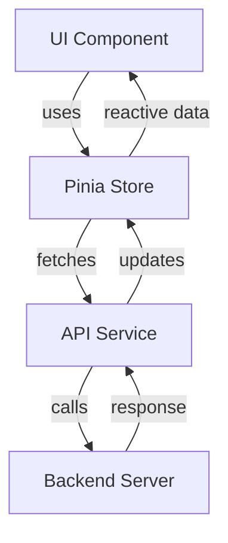

# Architecting Vue.js 3 Enterprise-Ready Web Applications

## 📘 Main Concepts

- **Modular Architecture**: Break your app into cohesive, loosely coupled modules.
- **Component-Based Design**: Use reusable UI components to maintain consistency and scalability.
- **State Management**: Use [Pinia](https://pinia.vuejs.org/) for scalable and modular state management.
- **Routing**: Use [Vue Router](https://router.vuejs.org/) for modular route configuration.
- **Type Safety**: Use TypeScript for large-scale apps.
- **Composition API**: Favor `setup()` and `composables/` to organize logic.
- **Separation of Concerns**: Use services, repositories, and composables to keep logic isolated.

---

## 📁 Recommended Folder Structure

```text
src/
├── assets/             # Static assets (images, fonts, etc.)
├── components/         # Reusable components
├── composables/        # Reusable composition functions (logic)
├── constants/          # Constant values and enums
├── layouts/            # App layout components
├── pages/              # Route components
├── router/             # Vue Router setup and route definitions
├── services/           # API services and business logic
├── stores/             # Pinia stores
├── types/              # TypeScript interfaces and types
├── utils/              # Utility functions
├── views/              # Feature-specific components and containers
├── App.vue             # Root component
└── main.ts             # App entry point
```

---

## 🔄 Data Flow Diagram



---

## 📚 Useful Links

- [Vue 3 Documentation](https://vuejs.org/)
- [Pinia State Management](https://pinia.vuejs.org/)
- [Vue Router](https://router.vuejs.org/)
- [VueUse Composables](https://vueuse.org/)
- [Vite - Build Tool](https://vitejs.dev/)
- [TypeScript in Vue](https://vuejs.org/guide/typescript/overview.html)